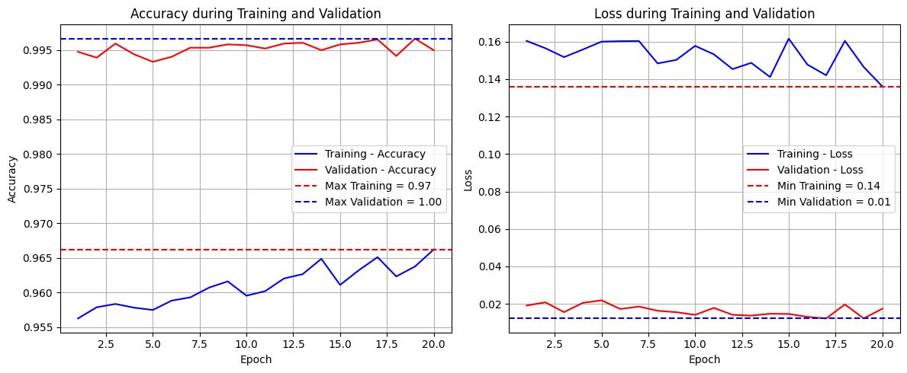
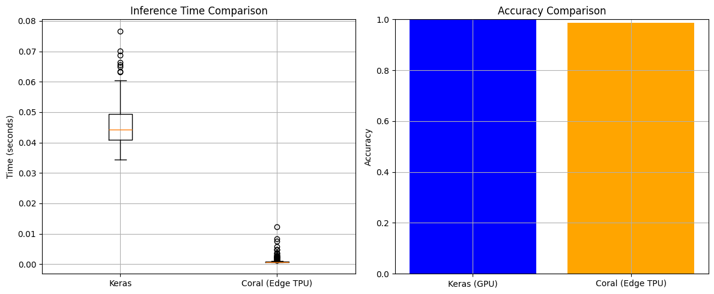
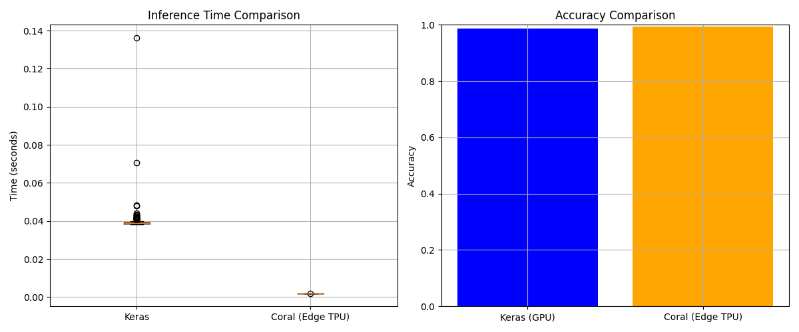

# Google Speech Commands Coral Quantization

This repository contains code and resources to quantize models for Google's Speech Commands dataset, optimized for execution on Google Coral devices (e.g., Coral USB Accelerator). The goal is to enable efficient speech command recognition on embedded hardware using TensorFlow Lite.

## Description

The project provides scripts and configurations to:
- Train and evaluate models based on the [Google Speech Commands dataset](https://ai.googleblog.com/2017/08/launching-speech-commands-dataset.html).
- Quantize models to reduce their size and improve performance on [Coral devices](https://coral.ai/docs/accelerator/get-started/).
- Deploy quantized models on hardware compatible with TensorFlow Lite Micro.

## Prerequisites

- Python 3.9    
- TensorFlow 2.x
- TensorFlow Lite
- Coral Python library
- Google Speech Commands dataset (downloadable from [here](https://storage.googleapis.com/download.tensorflow.org/data/speech_commands_v0.02.tar.gz))
- Edge TPU Compiler

### Install Dependencies
#### Install PYCoral
    python3.9 -m pip install --extra-index-url https://google-coral.github.io/py-repo/ pycoral~=2.0

#### Install edgetpu-compiler
    curl https://packages.cloud.google.com/apt/doc/apt-key.gpg | sudo apt-key add -

    echo "deb https://packages.cloud.google.com/apt coral-edgetpu-stable main" | sudo tee /etc/apt/sources.list.d/coral-edgetpu.list

    sudo apt-get update

    sudo apt-get install edgetpu-compiler libedgetpu1-std -y


    
## Installation

1. Clone this repository:
    ```
    git clone https://github.com/GalerasdotNET/google_speech_commands_coral_quantization.git
    cd google_speech_commands_coral_quantization
    ```

2. Download the Google Speech Commands dataset and extract it to the `audios/` directory:
   ```
   mkdir audios
   wget -P data/ https://storage.googleapis.com/download.tensorflow.org/data/speech_commands_v0.02.tar.gz
   tar -xvzf data/speech_commands_v0.02.tar.gz -C audios/
   ```

3. Install the dependencies:
   pip install -r requirements.txt

## Usage

### Step 1
Create Keras model with `create_model_keras.ipynb`

### Step 2
With the keras model, create the quantized TensorFlow Lite Model using `create_model_coral.ipynb`

### Step 3
use edgetpu_compiler to compile a TensorFlow Lite model into a compatible Edge TPU model
```
    edgetpu_compiler model_quantized.tflite
```


### Evaluation
Evaluate the quantized model on the test dataset

## Results

### Training
result With 20 epochs 


### Evaluations

#### Edge TPU vs Apple M3 Max


#### Edge TPU vs NVIDIA GeForce RTX 4060


#### Edge TPU vs AMD Ryzen 9 3900X


## Project Structure

- `google_speech_commands_coral_quantization/` - Root directory
  - `audios/`                       - Google Speech Commands dataset
  - `create_model_keras.ipynb`      - Training script in keras model
  - `create_model_coral.ipynb`      - Quantization script
  - `compare_models.ipynb`          - Evaluation script
  - `requirements.txt`              - Project dependencies
  - `README.md`                     - This file

## Contributing

Contributions are welcome! Please follow these steps:
1. Fork the repository.
2. Create a branch for your feature (`git checkout -b feature/new-feature`).
3. Commit your changes (`git commit -m "Add new feature"`).
4. Push your changes (`git push origin feature/new-feature`).
5. Open a Pull Request.

## License

This project is licensed under the [MIT License](LICENSE).

## Contact

For questions or support, contact [GalerasdotNET](mailto:galeras.net@udenar.edu.co).